# ml-models
training three simple datasets with three algorithms: perceptron, MLP, and RBF
ML course 404-405 spring
DR Hassanzade

### raw data visualization

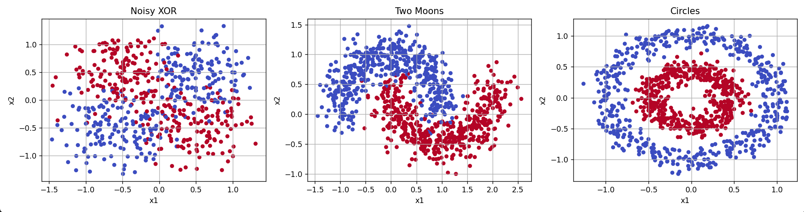

## dataset 1 : two moons
I trained the two moons dataset created by sk-learn. here's the outputs:

### perceptron

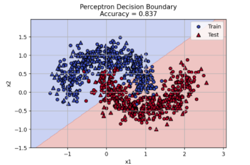
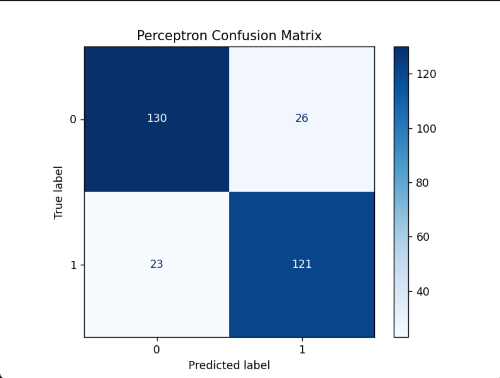

### MLP

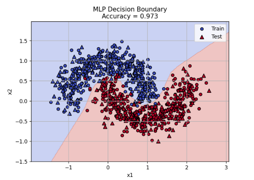
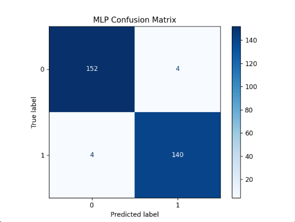

### RBF

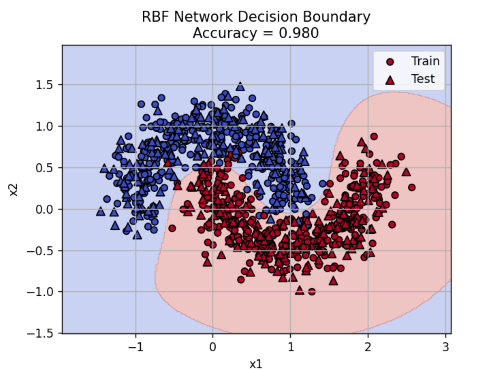
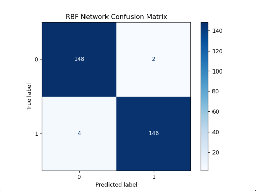

## dataset 2 : XOR
I trained the two moons custom created. here's the outputs:

### perceptron

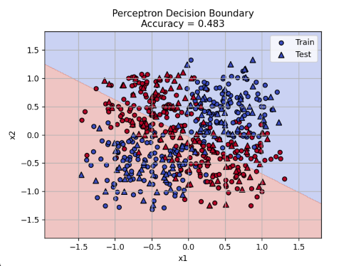
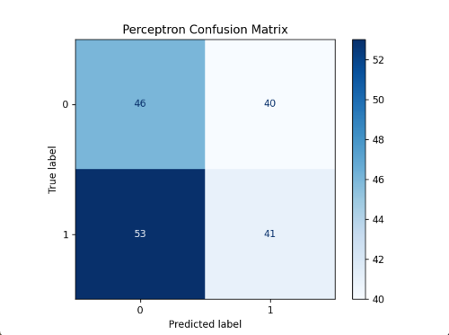

### MLP

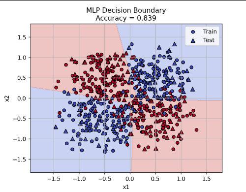
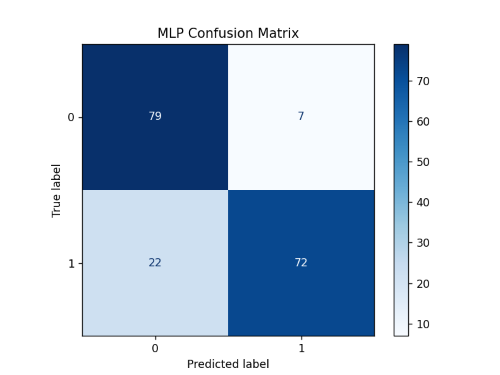

### RBF

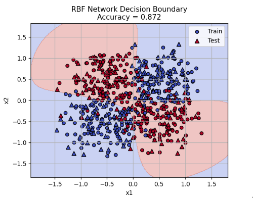
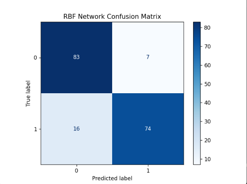

## dataset3 : circles

I trained the circles dataset created by sk-learn. here's the outputs:

### perceptron

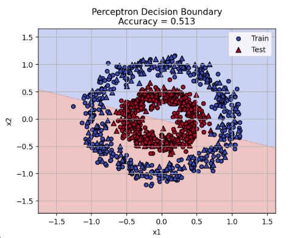
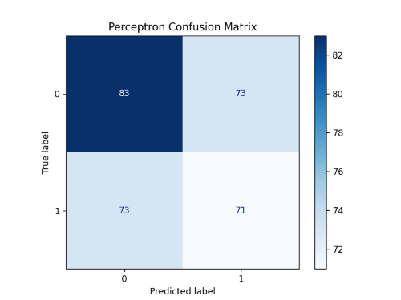

### MLP

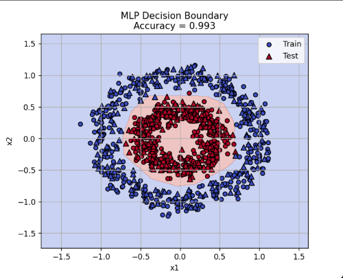
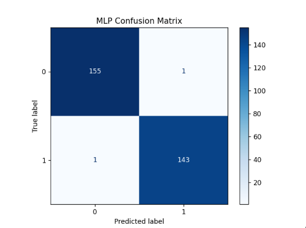

### RBF

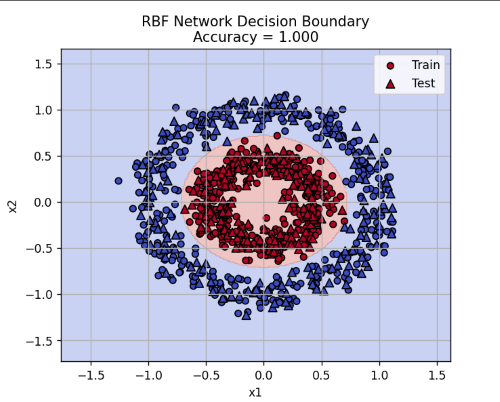

## comparison table

| dataset | perceptron accuracy | MLP accuracy | RBF Accuracy |
|---|---:|---:|---:|
| two Moons | 0.837 | 0.973 | 0.980 |
| XOR | 0.483 | 0.839 | 0.872 |
| circles | 0.513 | 0.993 | 0.999 |

## analysis